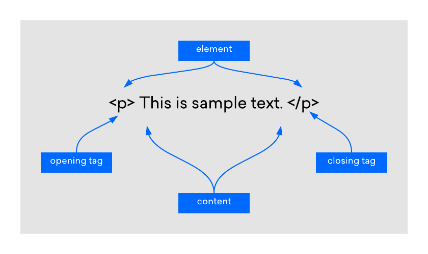

# HTML Tricks

> ⚠️ __Important__
> 
> __This guide is not meant to be any kind of definitive or comprehensive resource for HTML (or anything else).__
>
> Any information found anywhere in this repository is almost certainly __meant for something *very* specific__ and is likely __*extremely* oversimplified__.

## HTML Tage & Elements for Dummies

Because I want to keep this as easy and user friendly as I possibly can, I'm going to oversimplify things as much as I possibly can.

At its core, __HTML__ is built entirely with two main components: __Tags__ and __Elements__.

1. __Tags__: The *"Self-Contained"* Building Blocks of HTML.
2. __Elements:__ The foundation for basically all content on an HTML web page.

Below is a simple diagram that illustrates the differnt parts of an __HTML Element__


[What is an HTML Tag?](https://www.digitalocean.com/community/tutorials/what-is-an-html-tag#) tutorial by [DigitalOcean](https://digitalocean.com).





### HTML Tags

Tags are usually referred to as the *Building Blocks of HTML*, and that's exactly what they are. Everything in HTML is made of tags. Everything.


#### What does an *HTML Tag* look like?

HTML tags 


##### Line Breaks (New Line)
```html
<br />
<br/>
<br>
```


<br />

### HTML Elements

How are Elements different from Tags?

Elements are made of `<Open>` and `</Close>` tags.


No, it's nothing like a door opening and closing. Think of it more along the lines of __Beginning__ and __Ending__.

`<>`

<br /><br />

## Creating Embedded Hyperlinks

Adding and creating __Hyperlinks__ has become so universally streamlined and automated that, at this point, people just expect hyperlinks from any URL they paste into a text field, or send in a message.


And that's exactly how it should be. Universal defaults are (usually) a wonderful thing.


, because 99.9% of the time, that's exactly how it works for pretty much everything.


So, what happens when you paste a URL and it doesn't automatically become blue text that can magically take you to where you want to go?


### Basic Format


```html
<a href="URL">TEXT</a>
```


> ℹ️ __Note__
>
> This is meant to help average users take advantage of certain systems or platforms that offer **limited HTML support**, like some blogs.

> ℹ️ __Note__
>
> For more information about the HTML Anchor `<a>` Element, please refer to Mozilla's official [Anchor Element](https://developer.mozilla.org/en-US/docs/Web/HTML/Element/a) documentation.


### What is an hyperlink?


